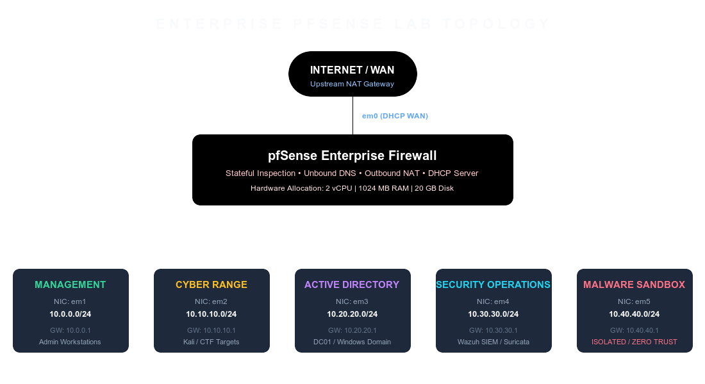

# Enterprise Firewall & Network Segmentation with pfSense



## Overview

This project documents the design, deployment, configuration, and validation of an **Enterprise-grade Virtual Firewall and Network Segmentation Infrastructure** powered by **pfSense Community Edition**.

Built as the secure core of a cybersecurity home lab environment, this virtual firewall acts as the gateway between the external Internet and five isolated internal network segments (Management, Cyber Range, Active Directory, Security Infrastructure, and Malware Analysis Lab).

---

## Technical Specifications & Architecture

| Parameter | Specification / Allocation |
| :--- | :--- |
| **Firewall Engine** | pfSense CE 2.7.x (FreeBSD 14.0-RELEASE base) |
| **Virtual Machine Specifications** | 2 vCPU, 1024 MB RAM, 20 GB VDI Storage |
| **Hypervisor** | Oracle VM VirtualBox |
| **Total Interfaces** | 6 (1 WAN NAT + 5 Segmented Internal Networks) |
| **Core Services** | Unbound DNS Resolver, DHCP Server, Outbound NAT, Stateful Packet Inspection |

---

## Network Segmentation Summary

| Interface Name | Logical Network Name | Subnet Range | Gateway IP | Description & Access Policy |
| :--- | :--- | :--- | :--- | :--- |
| `em0` | **WAN** | DHCP (NAT) | Variable | External Internet Access |
| `em1` | **Management (Mgmt)** | `10.0.0.0/24` | `10.0.0.1` | Admin workstations, pfSense WebGUI/SSH, full outbound access |
| `em2` | **Cyber Range (Cyber)** | `10.10.10.0/24` | `10.10.10.1` | CTF targets, attack platforms, penetration testing VMs |
| `em3` | **Active Directory (AD)** | `10.20.20.0/24` | `10.20.20.1` | Domain Controllers, enterprise Windows member servers |
| `em4` | **Security (Security)** | `10.30.30.0/24` | `10.30.30.1` | Security monitoring (Wazuh, SIEM, Suricata, syslog server) |
| `em5` | **Malware (Malware)** | `10.40.40.0/24` | `10.40.40.1` | Isolated malware analysis sandbox; zero cross-VLAN access |

---

## Repository Structure

```text
01-pfsense-firewall/
├── README.md                           # Main Project Documentation & Architecture Overview
├── architecture/
│   ├── network-diagram.drawio          # Draw.io editable network topology source diagram
│   ├── topology.png                    # Rendered visual topology network diagram
│   └── ip-plan.md                      # Detailed IP allocation, VLAN, and subnetting plan
├── installation/
│   ├── virtualbox.md                   # VirtualBox VM creation step-by-step guide
│   ├── pfsense-install.md              # pfSense ISO installation walkthrough
│   ├── interface-assignment.md         # NIC mapping (em0-em5) to networks
│   └── dhcp.md                         # DHCP scope configuration per interface
├── configuration/
│   ├── firewall-rules.md               # Complete firewall rules matrix & policy logic
│   ├── dns-resolver.md                 # Unbound DNS, domain overrides, & hardening
│   ├── nat.md                          # Outbound NAT rules & port forwarding setup
│   └── aliases.md                      # Firewall aliases definition and usage
├── screenshots/                        # Screenshots of WebGUI configuration states
├── validation/
│   ├── connectivity.md                 # Inter-VLAN routing and ping matrix validation
│   └── troubleshooting.md              # Common setup issues and diagnostic solutions
└── backup/
    └── config.xml                      # Production-ready exported pfSense configuration
```

---

## Quick Start & Installation Order

1. **[VirtualBox Setup](installation/virtualbox.md)**: Create VM with 6 NICs.
2. **[pfSense OS Installation](installation/pfsense-install.md)**: Install FreeBSD base and pfSense.
3. **[Interface Assignment](installation/interface-assignment.md)**: Assign `em0` to `em5`.
4. **[IP Plan & DHCP](architecture/ip-plan.md)**: Apply IP addressing and DHCP pools.
5. **[Firewall Policy Configuration](configuration/firewall-rules.md)**: Deploy stateful rules and aliases.
6. **[Validation & Verification](validation/connectivity.md)**: Execute inter-VLAN test suite.

---

## License & Attribution

This configuration is designed for enterprise lab simulation and cybersecurity training. Distributed under the MIT License.
