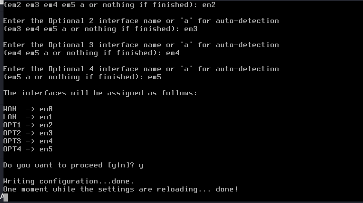
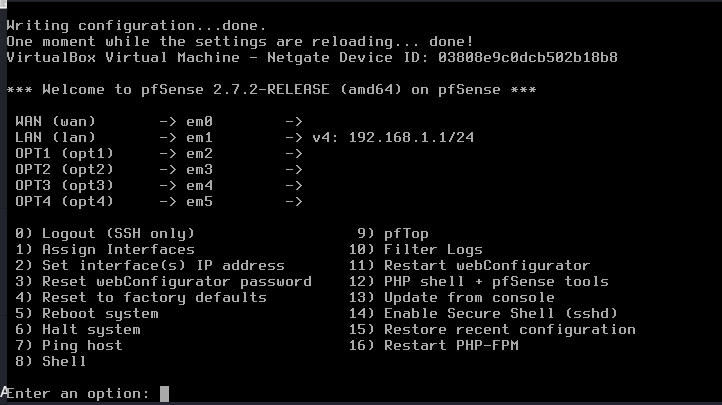

# Interface Assignment & NIC Mapping Guide

## Overview

pfSense relies on FreeBSD network interface drivers. On VirtualBox using Intel PRO/1000 MT Desktop NICs, interfaces are identified as `em0` through `em5`.

---

## Console Interface Assignment Walkthrough

1. From the pfSense console menu, enter option `1` (**Assign Interfaces**).
2. **VLAN Setup**:
   * Prompt: `Should VLANs be set up now [y|n]?`
   * Type `n` and press `Enter`.

3. **WAN Interface Assignment**:
   * Prompt: `Enter the WAN interface name or 'a' for auto-detection:`
   * Type `em0` and press `Enter`.

4. **LAN / Management Interface Assignment**:
   * Prompt: `Enter the LAN interface name or 'a' for auto-detection:`
   * Type `em1` and press `Enter`.

5. **Optional Interfaces Assignment**:
   * Prompt: `Enter the Optional 1 interface name or 'a' for auto-detection:` -> `em2` (Cyber)
   * Prompt: `Enter the Optional 2 interface name or 'a' for auto-detection:` -> `em3` (AD)
   * Prompt: `Enter the Optional 3 interface name or 'a' for auto-detection:` -> `em4` (Security)
   * Prompt: `Enter the Optional 4 interface name or 'a' for auto-detection:` -> `em5` (Malware)
   * Press `Enter` when no additional interfaces remain.

6. **Confirmation**:
   * Review interface summary:
     * WAN -> `em0`
     * LAN -> `em1`
     * OPT1 -> `em2`
     * OPT2 -> `em3`
     * OPT3 -> `em4`
     * OPT4 -> `em5`
   * Type `y` and press `Enter` to commit changes.

Once settings finish reloading, the main console menu displays the newly assigned interfaces:

## WebGUI Interface Configuration (Post-Wizard)

Do not start installing virtual machines yet! First, configure pfSense interfaces properly via WebGUI.

### Step 1 — Rename Interfaces

Navigate to **Interfaces** $\rightarrow$ **Interface Assignments** in the pfSense WebGUI:

| Current Interface Name | New Descriptive Name | Driver | Logical Function |
| :--- | :--- | :--- | :--- |
| `LAN` | **`MGMT`** | `em1` | Management Network Gateway |
| `OPT1` | **`CYBER`** | `em2` | Cyber Range Subnet Gateway |
| `OPT2` | **`AD`** | `em3` | Active Directory Subnet Gateway |
| `OPT3` | **`SECURITY`** | `em4` | Security Operations Subnet Gateway |
| `OPT4` | **`MALWARE`** | `em5` | Isolated Malware Sandbox Gateway |

> [!TIP]
> **Why rename interfaces?**
> Firewall rules become much easier to read and maintain. Instead of abstract rules like `Allow OPT2 → OPT3`, you will see clean rules like `Allow AD → SECURITY`.

---

### Step 2 — Configure Each Interface IP & Gateway

Navigate to **Interfaces** $\rightarrow$ **[Interface Name]** to enable each interface, select **Static IPv4** as IPv4 Configuration Type, and assign these gateway IPs:

| Interface Name | Assigned IP Address (CIDR) | Alternative Subnet Scheme | Gateway Role |
| :--- | :--- | :--- | :--- |
| **MGMT** | `10.0.0.1/24` | `192.168.10.1/24` | Default gateway for Management subnet |
| **CYBER** | `10.10.10.1/24` | `192.168.20.1/24` | Default gateway for Cyber Range subnet |
| **AD** | `10.20.20.1/24` | `192.168.30.1/24` | Default gateway for Active Directory subnet |
| **SECURITY** | `10.30.30.1/24` | `192.168.40.1/24` | Default gateway for Security Operations subnet |
| **MALWARE** | `10.40.40.1/24` | `192.168.50.1/24` | Default gateway for Malware Sandbox subnet |

> [!NOTE]
> Every interface IP address acts as the **default gateway** and **DNS resolver** for all host devices connected to that specific network segment.

---

## Console IP Configuration for Management (LAN / `em1`)

To configure the initial Management IP from console before WebGUI access:
1. Select Console Option `2` (**Set interface(s) IP address**).
2. Select interface index for `LAN` (`em1`).
3. Enter new IPv4 address: `10.0.0.1` (or `192.168.10.1`).
4. Enter IPv4 subnet mask bit count: `24`
5. For WAN gateway on LAN, press `Enter` (None).
6. Enter `y` to enable DHCP server on LAN.
7. Enter start address: `.100`, end address: `.200`.
8. Do not revert to HTTP (keep HTTPS).

<!-- minimal update -->
