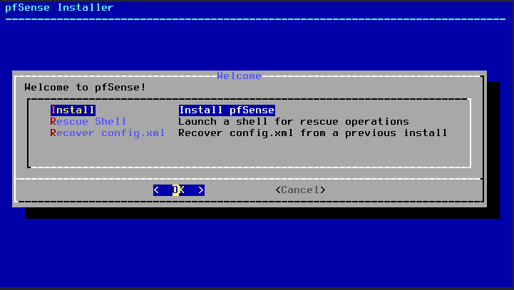
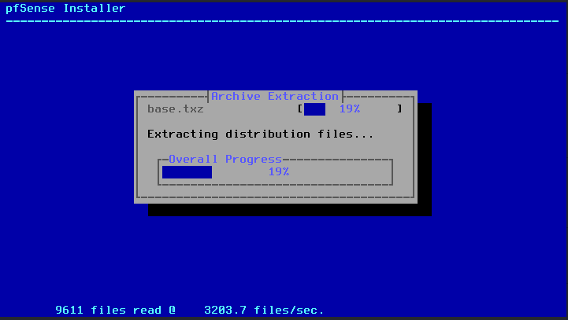
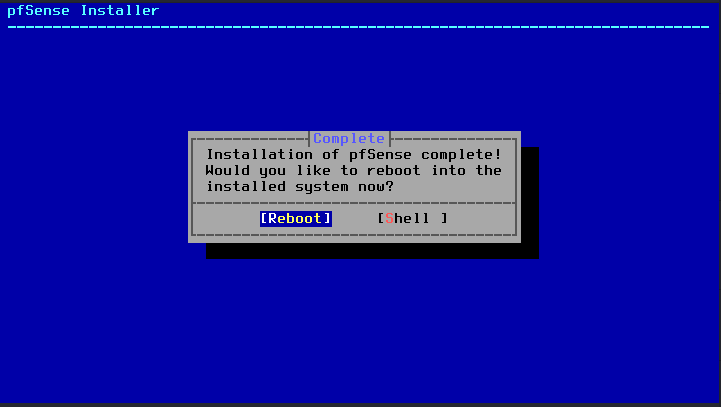
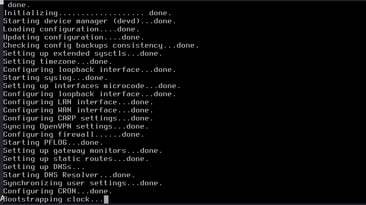
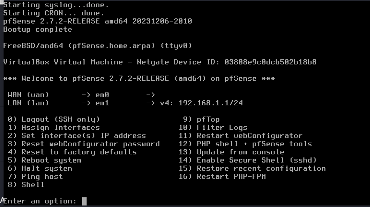

# pfSense OS Installation Walkthrough

## Overview

This document guides you step-by-step through installing **pfSense CE 2.7.2** from ISO image onto the provisioned VirtualBox virtual machine.

---

## Step-by-Step Installation Procedure

### Step 1: Booting the ISO
1. Start the `pfSense-Firewall` VM in VirtualBox.
2. The pfSense installer splash screen will display. Press `Enter` or wait 10 seconds for autoboot.
3. Accept the **Copyright and Distribution Notice** by selecting `<Accept>`.

---

### Step 2: Installer Options



1. On the main installer menu select:
   * **`Install`**: (Install pfSense) and press `Enter`.
2. **Keymap Selection**: Keep default (`Test and continue with default keymap`).
3. **Partitioning**:
   * Select **`Auto (ZFS)`** or **`Auto (UFS) BIOS`** (UFS is lightweight and recommended for 1024 MB RAM).
   * Choose **`Entire Disk`** and confirm partition layout.
   * Confirm writing changes to disk by selecting `<Yes>`.

---

### Step 3: Installation & Reboot

1. The installer will extract base distribution tarballs (`base.txz`, `kernel.txz`).



2. Upon completion, select `<No>` when prompted to open a shell for manual modification.



3. Select `<Reboot>`.
4. Immediately unmount the ISO from VirtualBox Optical Drive (`vboxmanage storageattach "pfSense-Firewall" --storagectl "IDE Controller" --port 0 --device 0 --medium none`) to prevent booting back into the installer.

---

## Console Initial Configuration Screen

During system boot, pfSense initializes network drivers and services:



Once booted into pfSense OS, the text-based console menu displays:



```text
*** Welcome to pfSense 2.7.2-RELEASE (amd64) ***

  WAN (wan)       -> em0        -> v4/DHCP: 10.0.2.15/24
  LAN (lan)       -> em1        -> v4: 192.168.1.1/24

 0) Logout (SSH only)                  9) pfTop
 1) Assign Interfaces                 10) Filter Logs
 2) Set interface(s) IP address       11) Restart webConfigurator
 3) Reset webConfigurator password    12) PHP shell + pfSense tools
 4) Reset to factory defaults         13) Update from console
 5) Reboot system                     14) Enable Secure Shell (SSH)
 6) Halt system                       15) Restore recent configuration
 7) Ping host                         16) Restart PHP-FPM
 8) Shell
```

---

## Verification & Post-Install Checklist

- [x] pfSense boots cleanly without FreeBSD kernel panic.
- [x] Console menu `0-16` appears successfully.
- [x] Optical ISO drive detached.
- [x] Ready for interface assignment.

---

## Step 4 — Verify Internet Egress (Post-Wizard)

Before deploying any virtual machines, confirm that your WAN interface is correctly configured and that pfSense can reach the internet.

1. In the pfSense WebGUI, navigate to **Diagnostics** → **Ping**.
2. Run the following ping tests:

| Target | Type | Expected Result |
| :--- | :--- | :--- |
| `1.1.1.1` | IP Address | Success — verifies WAN routing & NAT are working |
| `google.com` | Hostname | Success — verifies DNS resolution is functional |

> [!IMPORTANT]
> If `1.1.1.1` fails, your WAN NAT adapter is misconfigured — check VirtualBox Adapter 1 is set to **NAT** with the **Cable Connected** checkbox ticked.
> If `1.1.1.1` succeeds but `google.com` fails, pfSense DNS Resolver (`Unbound`) is not running. Navigate to **Services** → **DNS Resolver** and start the service.

---

## Step 6 — Take a Baseline VirtualBox Snapshot (Post-Wizard)

After completing all pfSense post-wizard configuration (Steps 1–5), take a VirtualBox snapshot to preserve this clean baseline state.

1. With the `pfSense-Firewall` VM **running**, open the VirtualBox **Machine** menu.
2. Select **Take Snapshot…**
3. Name the snapshot exactly:

   ```
   01 - Fresh pfSense
   ```

4. Add a description (optional but recommended):

   ```
   pfSense 2.7.2 fully configured: interfaces renamed, IPs assigned, DHCP enabled, internet verified, aliases created. Ready for lab VM deployment.
   ```

5. Click **OK**.

> [!TIP]
> If anything breaks during subsequent VM deployments, you can instantly restore to this clean baseline via **Machine** → **Restore Snapshot** — without reinstalling pfSense from scratch.

<!-- minimal update -->
